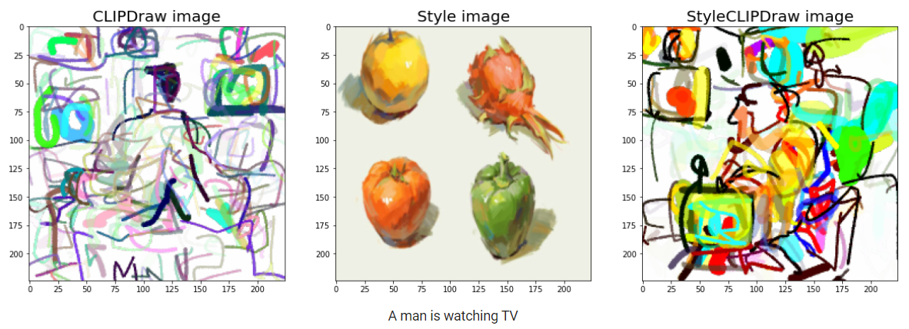
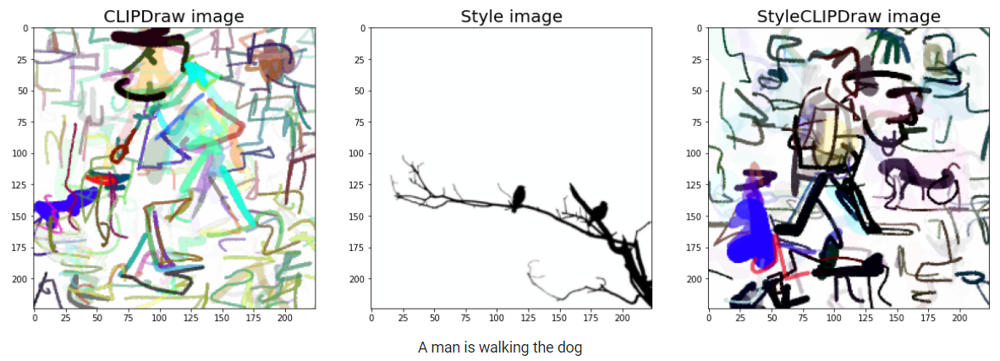
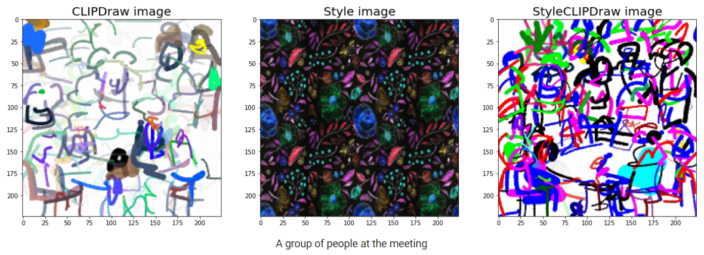
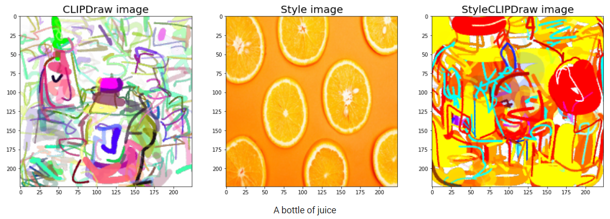

## Reimplementation of StyleCLIPDraw

StyleCLIPDraw: Coupling Content and Style in Text-to-Drawing Synthesis

    
  </a>

    
  </a>

    
  </a>

    
  </a>

> StyleCLIPDraw adds a style loss to the CLIPDraw text-to-drawing synthesis model to allow artistic control of the synthesized drawings in addition to control of the content via text. Whereas performing decoupled Style Transfer on a generated image only affects the texture. The proposed StyleCLIPDraw coupled approach is able to capture a style in both texture and shape, suggesting that the style of the drawing is coupled with the drawing process itself.

Project for Neural Networks course.

[**GOOGLE COLAB**](https://colab.research.google.com/drive/1pVFD_1lN3xRgOChpZxZTV8rAPQOEAeQo?usp=sharing)                                                                                                         
(Colab loading may take few minutes.. )

### 📝 Project documentation

[**PRESENTATION**](https://github.com/mms-ngl/nn/blob/main/presentation.pdf)

